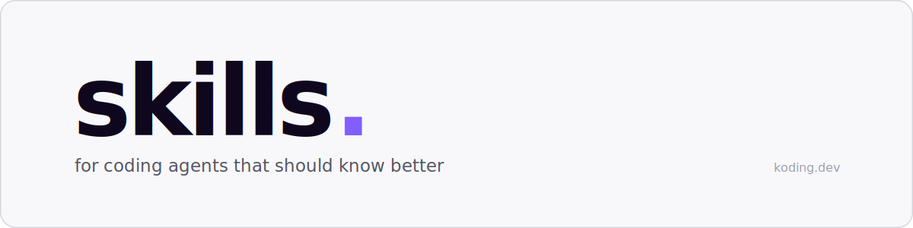

<p align="center">
  
</p>

[](https://skills.sh/KodingDev/skills) · [MIT](./LICENSE)

Agent skills I actually use to get real work done with coding agents — not vibe
coding. Each one is a single folder: a `SKILL.md` and whatever files it needs.
No runtime, no config, nothing to wire up.

They follow the [skills.sh](https://skills.sh) format, so they run in Claude
Code, pi, and anything else that speaks Agent Skills. Small, easy to adapt,
composable, and model-agnostic. Fork them, tweak them, make them yours.

## Quickstart

```bash
npx skills@latest add KodingDev/skills
```

Pick the skills you want and which agents to install them on. That's it.

## What's inside

### Engineering

- **[cdk-best-practices](./skills/engineering/cdk-best-practices/SKILL.md)** —
  point it at AWS CDK code (a file, a construct, a whole package) and it audits
  against a 27-rule catalog: least-privilege grants, broad IAM, hardcoded names,
  removal policies, construct anatomy, CDK Nag, and more. Returns a prioritized
  `file:line` report with a concrete fix per finding.

- **[golden](./skills/engineering/golden/SKILL.md)** — build-time bias toward
  the durable version of whatever's being built. Kills the two classic failure
  modes (the converter that wraps the old mess, the speculative over-build) and
  holds the bar: one source of truth, nothing special, schema-first contracts,
  composable pieces, damn simple, zero comment narration, real types and TSDoc
  on public surfaces, a DX pass to finish. Golden from the start instead of
  audit-and-refactor later.

- **[orchestrate](./skills/engineering/orchestrate/SKILL.md)** — judgment for
  multi-agent work: builders and critics never share incentives or context,
  cheap models compile while expensive models judge (and one brain reads the
  result), facts go in and verdicts come out, and deterministic tools shrink
  the corpus before any agent reads a byte.

### Project Planning

- **[plan-project](./skills/planning/plan-project/SKILL.md)** — user-invoked
  (`/plan-project`). Takes a project from "I have ideas" — plus any design docs
  or ADRs — to a review-ready backlog: it reconciles messy intake, breaks the
  work into vertical-slice tickets, writes them to a mini-PRD quality bar,
  sequences them by real dependencies, assigns by capacity, and shapes the
  result for Jira or Linear. Codebase-aware; produces markdown, never live writes.

## Adding a skill

Drop a folder under a bucket, write `SKILL.md`, then register it in the README,
its bucket README, and `plugin.json`. Conventions live in
[`CLAUDE.md`](./CLAUDE.md).

```
skills/<bucket>/<skill>/SKILL.md   the skill, plus any support files it reads
.claude-plugin/plugin.json         manifest skills.sh installs from
```

MIT © Stella Inwood
