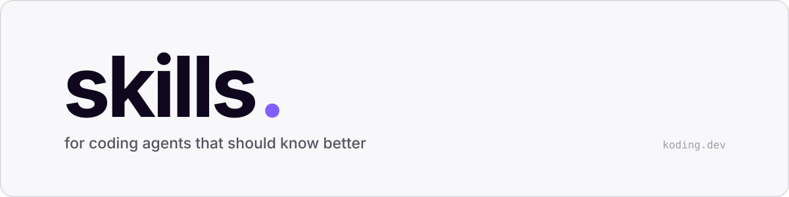

<p align="center">
  
</p>

[](https://skills.sh/KodingDev/skills) · [MIT](./LICENSE)

Agent skills I actually use to get real work done with coding agents — not vibe
coding. Each one is a single folder: a `SKILL.md` and whatever files it needs.
No runtime, no config, nothing to wire up.

They follow the [skills.sh](https://skills.sh) format, so they run in Claude
Code, pi, and anything else that speaks Agent Skills. Small, easy to adapt,
composable, and model-agnostic. Fork them, tweak them, make them yours.

## Quickstart

```bash
npx skills@latest add KodingDev/skills
```

Pick the skills you want and which agents to install them on. That's it.

## What's inside

### Engineering

- **[canon](./skills/engineering/canon/SKILL.md)** — golden's sibling for the
  understanding stage: porting a decompiled reference, reading a library or
  serialized format from the outside, chasing a regression. The record is
  canon; a story about what the system might do is headcanon. Four-part creed
  — it is deterministic, there is always a pointer, there is always a source,
  and it was built the smart generic way — plus a smell catalog for headcanon
  (constructed paths, invented taxonomies, invented corrections, downstream
  patches, bespoke subsystems, accumulating cutouts) and the loop that
  replaces each with a traced, source-cited fix.

- **[cdk-best-practices](./skills/engineering/cdk-best-practices/SKILL.md)** —
  point it at AWS CDK code (a file, a construct, a whole package) and it audits
  against a 27-rule catalog: least-privilege grants, broad IAM, hardcoded names,
  removal policies, construct anatomy, CDK Nag, and more. Returns a prioritized
  `file:line` report with a concrete fix per finding.

- **[foreman](./skills/engineering/foreman/SKILL.md)** — user-invoked
  (`/foreman`). Delivery orchestration for big multi-PR changes: one
  orchestrator agent that writes no code itself — it runs issue-tracker
  tickets, cuts a fresh worktree per ticket, briefs workers, self-reviews,
  and puts one human-reviewable PR per ticket in front of you. No stacked
  PRs, every line reviewed, velocity from concurrency across disjoint
  file-scope lanes. The invariants (the loop, brief template, PR
  conventions, stop-and-ask discipline) live in the skill, so a new program
  needs only two thin project files: a playbook of variables and a workplan
  of per-ticket briefs.

- **[golden](./skills/engineering/golden/SKILL.md)** — build-time bias toward
  the durable version of whatever's being built. Kills the two classic failure
  modes (the converter that wraps the old mess, the speculative over-build) and
  holds the bar: one source of truth, nothing special, schema-first contracts,
  composable pieces, damn simple, zero comment narration, precise signatures
  and doc comments on public surfaces, a DX pass to finish. Golden from the
  start instead of audit-and-refactor later.

- **[lean-containers](./skills/engineering/lean-containers/SKILL.md)** — the
  five rules that cover ~90% of container quality, applied whenever a
  Dockerfile is written or reviewed: slim over alpine (musl recompiles what
  glibc just installs), layer order as the cache strategy (peel the onion —
  manifests, install, then source), `.dockerignore` instead of surgical
  COPYs, builder stage as the bloat zone with scratch/distroless finals, and
  digests pinned over movable tags. Plus the honest escape hatch: one process
  per container is a vibe, not a law.

- **[orchestrate](./skills/engineering/orchestrate/SKILL.md)** — judgment for
  multi-agent work: builders and critics never share incentives or context,
  cheap models compile while expensive models judge (and one brain reads the
  result), facts go in and verdicts come out, and deterministic tools shrink
  the corpus before any agent reads a byte.

- **[pair](./skills/engineering/pair/SKILL.md)** — user-invoked (`/pair`).
  Pair-programming mode: the agent stops being a contractor that returns with
  a diff and becomes the colleague in the next chair. One move per turn — an
  edit, a rename, an opinion about a fork — then the keyboard comes back to
  you at a live decision point. Forks get talked through before typing, small
  things (names, seams, boundaries) are treated as the real work, and there's
  no finish line to sprint toward: the session ends when you end it. Pairs
  well with manual permission mode for the full accept-each-edit feel.

- **[rehab](./skills/engineering/rehab/SKILL.md)** — user-invoked (`/rehab`).
  Rehabilitates an AI-assisted codebase that's gone sloppy, on one law:
  enforce, don't instruct. Six stages — triage what actually runs vs what's
  decoration, fix the map the agent reads (stale docs are why it "won't
  listen"), put the rules file on a ~300-word diet, convert every prose rule
  into a check that fails inside the agent's own loop, pay down the worst
  debt behind characterization tests, and close the loop so caught
  anti-patterns become law the same day. Ships a symptom → check catalog
  covering both code slop and the quieter killer, context rot.

### Project Planning

- **[design-space](./skills/planning/design-space/SKILL.md)** — user-invoked
  (`/design-space`). A charrette that runs before a line of code: it grounds in
  what already exists, lands a one-sentence thesis and three *named*
  anti-references, names the 3–5 axes the design actually varies on, then
  generates 4–6 mutually incompatible corners and presents them flat — no
  ranking, because a ranked list gets the safest card picked. Ends with a
  one-page written space: live, dead (with reasons), open, and fixed. Holds the
  point of commitment open on purpose, and hands off to a build skill.

- **[linear-method](./skills/planning/linear-method/SKILL.md)** — the
  [Linear Method](https://linear.app/method) encoded as working rules rather than
  background reading. Momentum is the thing being protected: initiatives that a
  team can decide against without asking, goals derived backwards from the rung
  before them, every priority call labelled enabler or blocker with a
  now-or-later answer, projects that ship in 1–3 weeks with 1–3 people or get
  staged until they do, issues that name a task instead of user stories,
  two-week cycles that mix feature and quality work, design projects staged
  rather than estimated, and launch-and-keep-launching over one dated moment.
  Branches into `direction.md` (what to build) and `building.md` (doing it).

- **[plan-project](./skills/planning/plan-project/SKILL.md)** — user-invoked
  (`/plan-project`). Takes a project from "I have ideas" — plus any design docs
  or ADRs — to a review-ready backlog: it reconciles messy intake, breaks the
  work into vertical-slice tickets, writes them to a mini-PRD quality bar,
  sequences them by real dependencies, assigns by capacity, and shapes the
  result for Jira or Linear. Codebase-aware; produces markdown, never live writes.

## Adding a skill

Drop a folder under a bucket, write `SKILL.md`, then register it in the README,
its bucket README, and `plugin.json`. Conventions live in
[`CLAUDE.md`](./CLAUDE.md).

```
skills/<bucket>/<skill>/SKILL.md   the skill, plus any support files it reads
.claude-plugin/plugin.json         manifest skills.sh installs from
```

MIT © Stella Inwood
