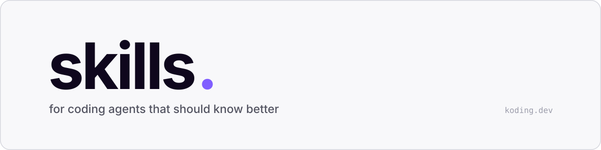

<p align="center">
  
</p>

[](https://skills.sh/KodingDev/skills) | [MIT](./LICENSE)

The agent skills I use for daily work with coding agents. Each skill is one folder: a `SKILL.md` and the files it reads. There is no runtime and no config.

The skills use the [skills.sh](https://skills.sh) format, so they run in Claude Code, pi, and any other agent that reads Agent Skills. Fork them and change them to fit your work.

## Install

```bash
npx skills@latest add KodingDev/skills
```

Pick the skills and the agents to install them on.

## Skills

Skills marked **`/name`** are user-invoked: they run only when you type the name. The agent reaches every other skill on its own when the task matches.

### Engineering

How the code gets built and reviewed.

| Skill | What it does |
| --- | --- |
| [golden](./skills/engineering/golden/SKILL.md) | Builds the durable version of anything new, exactly as simple as the problem. Also the review lens for shape: no converters, no over-build, variation as data. |
| [canon](./skills/engineering/canon/SKILL.md) | Golden's sibling for studying a system: a port, a library, a bug. The system is deterministic, there is always a pointer and a source, and every fix cites it. |
| [function-design](./skills/engineering/function-design/SKILL.md) | Designs and reviews single functions for honest dependencies, a useful signature, and one level of abstraction. TypeScript and C# examples. |
| [house-style](./skills/engineering/house-style/SKILL.md) | The style for writing good code, as the review bar for every change: names, control flow, errors, comments, STE writing, tests, and git, with TypeScript and React references. Builds on golden, canon, and function-design. |
| [lean-containers](./skills/engineering/lean-containers/SKILL.md) | Dockerfile discipline: slim over alpine, layer order as the cache strategy, `.dockerignore`, multi-stage builds, pinned digests. |
| [cdk-best-practices](./skills/engineering/cdk-best-practices/SKILL.md) | Audits AWS CDK code against a 27-rule catalog and returns a prioritized `file:line` report with a fix per finding. |
| [dotnet-profiling](./skills/engineering/dotnet-profiling/SKILL.md) | .NET profiling routed by who can read the output: the `dotnet-*` tools first, dotTrace through Rider's MCP tools, and the traps that make collects hang. |

### Working with agents

How the sessions run.

| Skill | What it does |
| --- | --- |
| [**`/pair`**](./skills/engineering/pair/SKILL.md) | Pair-programming mode. One move per turn, forks talked through before typing, and the keyboard back to you at each decision. |
| [**`/red-team`**](./skills/engineering/red-team/SKILL.md) | A subagent argues against a point for two to four rounds. You get a verdict: what survived, what changed, what is still open. |
| [**`/foreman`**](./skills/engineering/foreman/SKILL.md) | Delivery for big changes: tickets, a worktree per ticket, worker fan-out, and one reviewable PR per ticket per repo. In Claude Code, `/lanes` shows live lanes, stalls, and what needs you. |
| [**`/rehab`**](./skills/engineering/rehab/SKILL.md) | Rehabilitates a sloppy AI-assisted codebase: fix the docs the agent reads, cut the rules file, and turn prose rules into checks. |
| [orchestrate](./skills/engineering/orchestrate/SKILL.md) | Judgment for multi-agent work: separate builders from critics, cheap models compile and expensive models judge, tools shrink the corpus first. |
| [using-codex](./skills/engineering/using-codex/SKILL.md) | Hands code and test writing to the Codex CLI in a worktree. A script records each round and catches commits that Codex makes. You brief, review every hunk, and commit. |

### Design

| Skill | What it does |
| --- | --- |
| [**`/design-space`**](./skills/design/design-space/SKILL.md) | A charrette before any code: a thesis, named anti-references, the real design axes, and 4-6 incompatible directions, presented unranked. |
| [design-uplift](./skills/design/design-uplift/SKILL.md) | Turns a bland product into an identity: a locked foundation, numbered exploration passes, screenshot checks at every size, and a brand toolkit at the end. |

### Planning

| Skill | What it does |
| --- | --- |
| [linear-method](./skills/planning/linear-method/SKILL.md) | The [Linear Method](https://linear.app/method) as working rules: initiatives, enablers and blockers, 1-3 week projects, issues over user stories, cycles, launches. |
| [**`/plan-project`**](./skills/planning/plan-project/SKILL.md) | Turns ideas and design docs into a review-ready backlog of vertical-slice tickets, sequenced by dependency, for Jira or Linear. |

## Add a skill

Put a folder under a bucket and write its `SKILL.md`. Then add it to this README, to the bucket README, and to `plugin.json`. [`CLAUDE.md`](./CLAUDE.md) holds the conventions.

```
skills/<bucket>/<skill>/SKILL.md   the skill, plus the files it reads
skills/<bucket>/<skill>/hooks/     optional Claude Code mod; other agents ignore it
.claude-plugin/plugin.json         the manifest that skills.sh installs from
```

MIT (c) Stella Inwood
